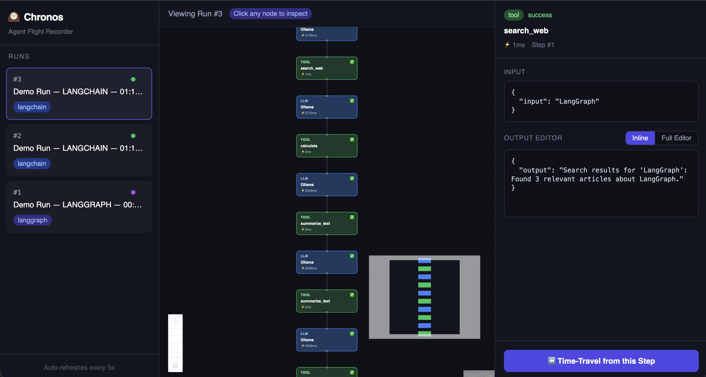

# Chronos 

> Agent Flight Recorder & Time-Travel Debugger for LLM workflows.

**Live Demo**: http://3.145.47.206:5173

Chronos intercepts every step of your LangChain or LangGraph agent run — capturing prompts, tool calls, outputs, token usage, and latency — and visualizes it as an interactive graph. Click any past step, edit the output, and resume execution from that exact point.



## Features

- 🔍 **Full trace capture** — every LLM call, tool invocation, and node transition recorded
- 🕸️ **Visual graph UI** — see your agent's execution as a live, interactive flow diagram
- ⏪ **Time-travel debugging** — click any step, modify the output, resume from there
- ⚡ **Dual editor** — inline JSON edit for simple outputs, full prompt/response editor for complex ones
- 🔌 **LangChain + LangGraph** — works with both frameworks out of the box
- 🐳 **Docker ready** — single `docker-compose up` to run the full stack

## Tech Stack

- **Backend**: FastAPI, SQLite, LangChain, LangGraph, Python 3.11
- **Frontend**: React, Vite, Tailwind CSS, React Flow
- **Deployment**: Docker, AWS Lightsail

## Project Structure
chronos/
├── backend/        # FastAPI app, tracer, DB
├── frontend/       # React + Vite UI
├── demo_agent/     # Sample LangChain + LangGraph agent
└── docker-compose.yml

## Getting Started

### Prerequisites
- Docker + Docker Compose
- Ollama (for local LLM) or OpenAI API key

### Run locally

```bash
git clone https://github.com/gurusaichittoji7/Chronos.git
cd Chronos

# Add your env vars
cp backend/.env.example backend/.env

# Start the stack
docker-compose up --build -d
```

Frontend: http://localhost:5173  
Backend API: http://localhost:8000/docs

### Run the demo agent

Click ***▶ Run LangGraph Demo*** or ***▶ Run LangChain Demo*** in the sidebar — no terminal needed. A new run will appear automatically and the graph will build in real time.

## How It Works

1. Wrap your LangChain agent with `ChronosTracer` callback
2. Wrap your LangGraph nodes with `@lg_tracer.trace_node`
3. Every step is recorded — input, output, latency, token usage
4. Open the UI to visualize the run as an interactive graph
5. Click any node → edit the output → hit **Time-Travel** to resume from that point

## Author

**Gurusai Chittoji** — ML & AI Engineer  
[LinkedIn](https://linkedin.com/in/gurusai-chittoji-73a5a822a) · [GitHub](https://github.com/gurusaichittoji7)
